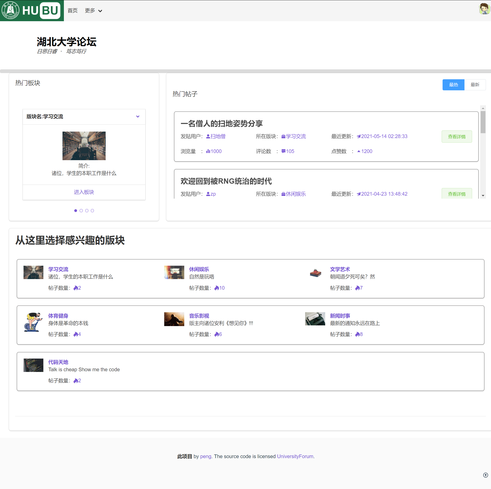
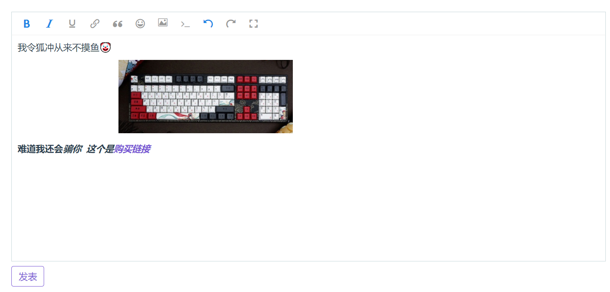
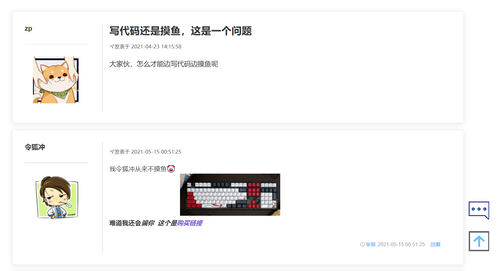
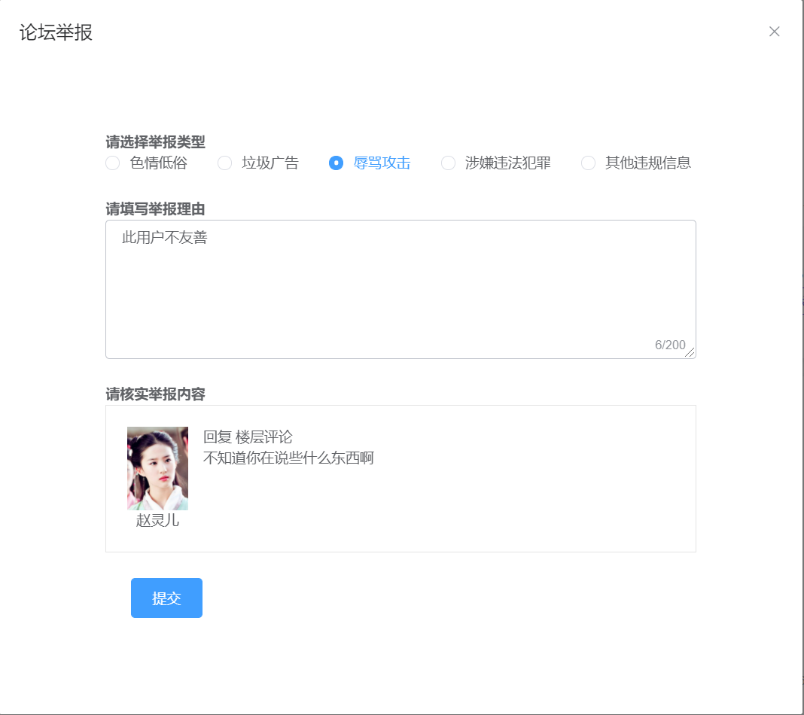
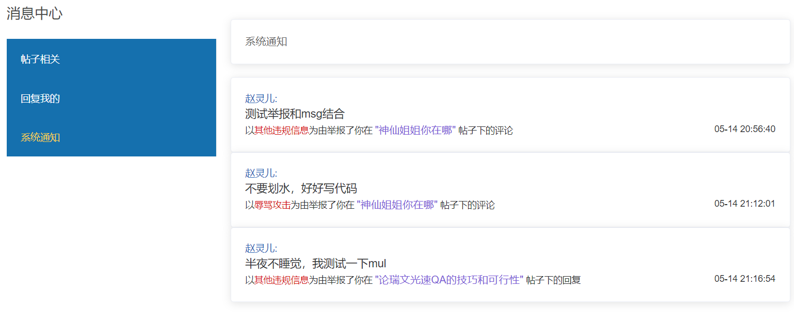
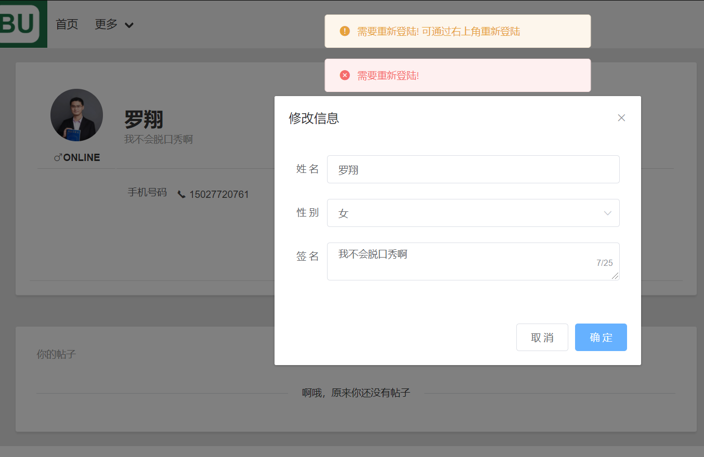

# universityforum-front

#### 技术栈

`vue`

`vuex`

`axios`

`vue-router`

`element-ui`


#### 项目部分截图

首页



登陆成功


发表帖子


发表评论



帖子预览


帖子详情页面



举报功能



消息中心



需要重新登陆




#### 项目运行

 Project setup（安装依赖）

```
yarn install或者npm install
```

Compiles and hot-reloads for development（启动项目）

```
yarn serve 或者npm run serve
```

Compiles and minifies for production（打包）

```
yarn run build 或者npm run build
```

